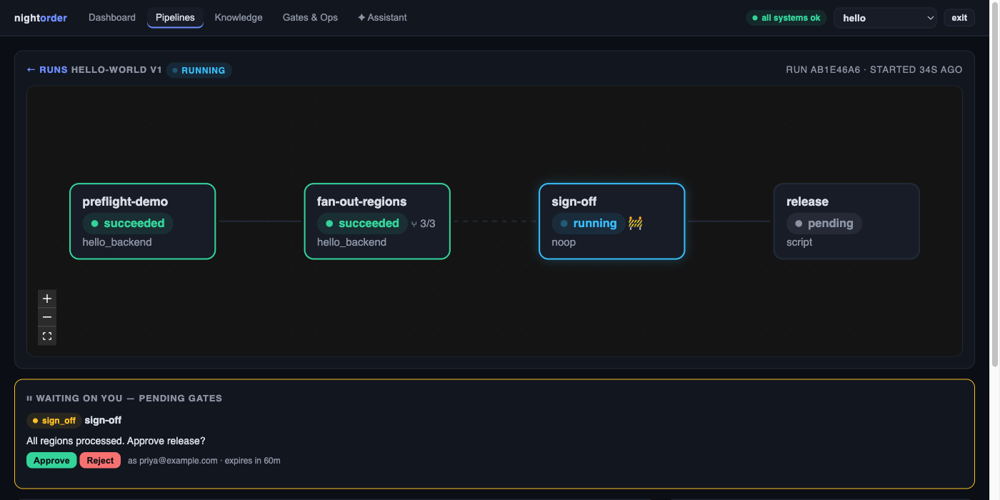
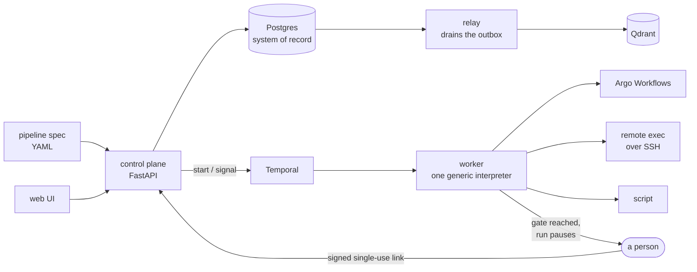
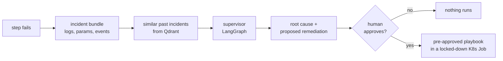
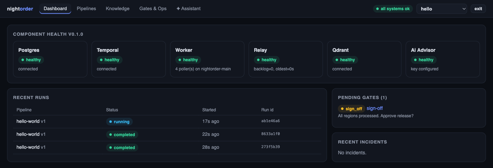
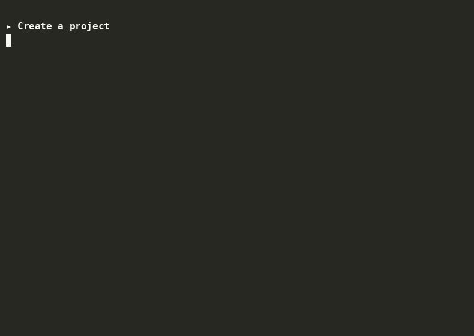
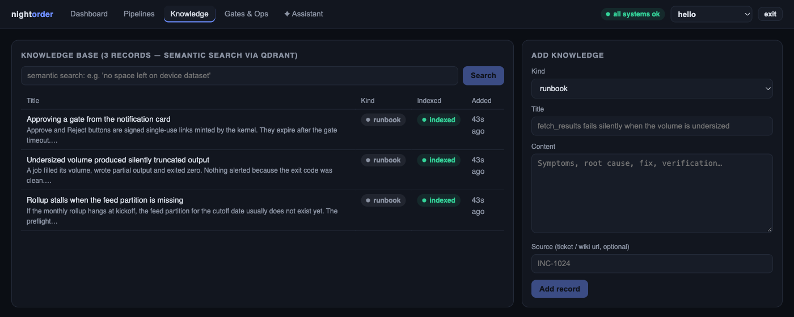

# nightorder

Long-running operational pipelines, written as declarative specs, interpreted by one
generic Temporal workflow — with human sign-off gates the run genuinely waits on.

The name is the captain's written order for the night watch: hold this course, and wake
me if X. That is the shape of the thing. A spec runs unattended until it reaches a
decision a person has to make, and then it stops and asks.



## Why

Runbooks rot. The knowledge lives in a wiki page and the execution lives in someone's
shell history. Moving them into a workflow engine usually means writing orchestration
code per pipeline, and the human approval step degrades into a chat message that nothing
actually enforces.

Here a pipeline is a YAML spec. One interpreter workflow runs any spec. A gate is a real
step: nothing past it executes until a person resolves it, and the approve link is a
signed, single-use token minted by the kernel.

## How it works



The control plane never orchestrates. It validates, records and signals; Temporal owns
execution. Events are written to Postgres and the outbox in the same transaction, so an
event is never lost and never duplicated, and the relay drains it separately.

When a step fails, an optional advisory path runs. It only ever proposes:



Only a pre-approved, versioned playbook — fixed image, fixed command — can execute, in a
hardened ephemeral Job. Free-form model output can never run.

## Quick start

```bash
uv sync
make infra                    # postgres :5433, qdrant :6333, temporal dev server
cp .env.example .env          # then edit it

make worker                   # terminal 1
make api                      # terminal 2 — http://localhost:8400, UI at /ui/
./scripts/demo.sh             # terminal 3 — the whole flow, start to audit trail
```

## The UI

Everything the API does is point-and-click at `/ui/`. The dashboard is live component
health, recent runs, and what is waiting on a human:



A run shows the DAG with live status, fan-out counts and a gate badge; below it, every
step with timings, and every parameter with the provenance of its value. The terminal
walkthrough is the same flow through the API:



Past incidents and runbooks are searchable semantically, and the assistant answers from
this base before anything else:



## A spec

```yaml
apiVersion: nightorder/v1
kind: Pipeline
name: monthly-rollup
project: batch

parameters:
  - name: yearmonth
    resolver: activity
    activity: now_yearmonth
  - name: cutoff
    resolver: activity          # newest partition actually present
    activity: command
    params: {command: ["sh", "-c", "gsutil ls gs://bucket/ | tail -1"]}

steps:
  - id: aggregate
    executor: argo
    preflight:
      - check: command_succeeds  # blocks kickoff if the input is missing
        params: {command: ["sh", "-c", "gsutil ls gs://bucket/day={{params.cutoff}}/"]}
        on_fail: block
    gate:
      type: sign_off
      prompt: "Submit the rollup for {{params.yearmonth}}? cutoff={{params.cutoff}}"
    config:
      manifest_file: batch/monthly_rollup.yaml
```

Preflight runs before the gate, so the person approving is looking at inputs that have
already been checked.

`examples/hello_world/` is the full contract test — parameters, preflight, a custom
executor, fan-out with tiers and a quota pool, a gate, and a script step.

## What it does

- **Specs, not code.** Validate, register, version. Teams onboard pipelines without
  touching the kernel.
- **Gates.** Sign-off and approval steps with signed single-use links, timeouts, and a
  delivery channel — log, webhook, or Teams.
- **Fan-out.** Over any list parameter, in tiers, under a shared concurrency quota.
- **Preflight.** Checks that stop a run before it burns hours on missing input.
- **Audit.** Every parameter, check, step and decision is an event, written through a
  transactional outbox.
- **Advisory and sandboxed remediation.** Both optional, both described above.

## Extending it

Four entry-point groups: `step_executors`, `preflight_checks`, `param_resolvers`,
`gate_channels`. Ship a pip-installable package, register against the contract, and the
worker loads it. `examples/hello_world/` is a complete consuming package.

## Security

The control plane is **open by default** — `NIGHTORDER_AUTH=off` means any caller that
can reach it can register specs, start runs and resolve gates. Both processes say so on
boot. It binds `127.0.0.1` unless you set `NIGHTORDER_API_HOST`.

Turning auth on requires a real `NIGHTORDER_GATE_TOKEN_SECRET`: the built-in development
value is in this source, so the process refuses to start with it under
`NIGHTORDER_AUTH=on`.

Spec authors are trusted — a `script` step runs commands. Expressions are narrower: they
are parsed and walked against an allowlist rather than evaluated, so a spec cannot reach
the worker's runtime through one.

Captured output is redacted before it is stored, displayed, or sent to the advisory
model. It is a safety net, not a guarantee.

## Tests

```bash
make test-unit   # 170 tests, no services needed
make test-e2e    # boots worker, api and relay against make infra
```

The e2e suite collects 23 tests. Thirteen run with no credentials and cover the
deterministic backbone. Eight more need `ANTHROPIC_API_KEY` for the advisory half; two
are opt-in against a real cluster (`NIGHTORDER_E2E_ARGO=1`, `NIGHTORDER_E2E_SANDBOX=1`)
and submit real workloads to whatever context is current — set `NIGHTORDER_KUBE_CONTEXT`
deliberately.

## Layout

```
kernel/src/nightorder/   spec schema, interpreter workflow, gates, API, builtins
  spec/                  schema, validation, expression evaluation
  temporal/              the one generic interpreter workflow and its activities
  api/                   FastAPI control plane, signed gate tokens
  ai/                    incident bundle, log reduction, knowledge, agents
ui/                      React SPA served at /ui
examples/                hello_world (contract test), rollup_mini, batch
manifests/               Argo workflows resolved by manifest_file:
k8s/sandbox/             sandbox service account and default-deny NetworkPolicy
```

Configuration is environment only — see `.env.example`. Design rationale is in
`docs/architecture.md`; onboarding a team is `docs/onboarding-guide.md`.
