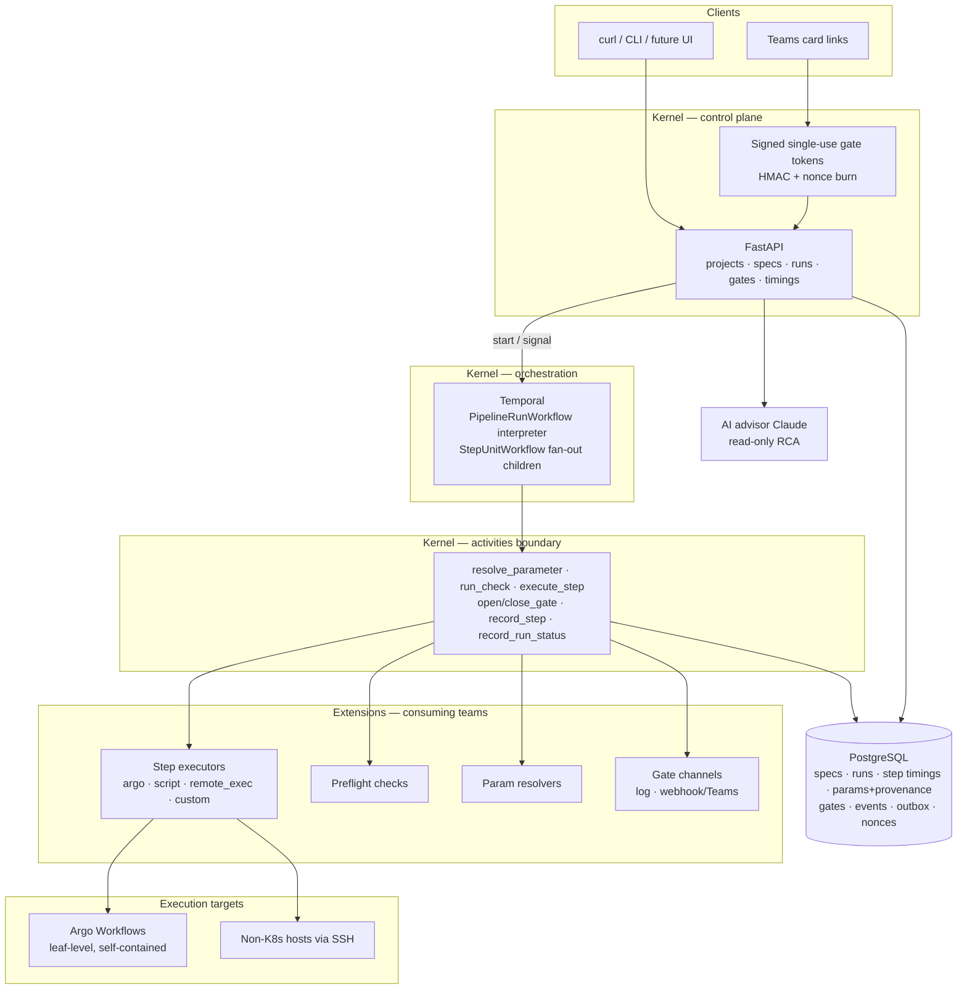

# Bosun — Architecture (Phases 1–3 implemented)

Decisions recorded here map to the platform prompt (Stage A). The validation
use case (rollup monthly pipeline) is modeled purely through public primitives —
zero rollup-specific platform code (see `examples/rollup_mini/`).

## Diagram

## Workflow Definition Model — (b) declarative spec

Pipelines are versioned YAML documents (`bosun/v1`), validated + linted at
registration, stored in Postgres, interpreted by **one generic Temporal
workflow** (`PipelineRunWorkflow`). Rationale: onboarding = writing a spec,
not code; specs are diffable, validatable, renderable; the escape hatch for
arbitrary logic is a **custom step executor** (registered extension), which
covers "python between Argo steps" without breaking the model.

## Kernel / extension boundary

| Kernel (platform team) | Extensions (consuming teams) |
|---|---|
| Interpreter workflow, DAG/gate/fan-out/quota/re-run mechanics | Step executors (new backends) |
| Event emission + transactional outbox, audit, timing capture | Preflight checks |
| Token minting/verification, replay protection | Parameter resolvers |
| Spec schema + validation, versioned storage, API + project auth | Gate delivery channels |
| Extension loading, contract validation, execution isolation | (Phase 2+) AI agents via Agent Registry |

**Registration mechanism: Python entry points.** A team ships a package with
`[project.entry-points."bosun.step_executors"] my_thing = "pkg.mod:Class"`;
installing the package into the worker image is the whole registration.
Bad-extension containment: load-time ABC validation (non-conforming classes
are skipped and logged), execution inside Activities with timeouts, failures
surface as step/check failures — never interpreter corruption.

**Project model.** Single platform instance, multi-project logical isolation:
every spec, run, gate, event, quota is project-scoped; shared Temporal/Postgres.
(Per-project Argo namespaces/SAs supported via step config `namespace:`.)
**Open-platform mode (current default):** projects are namespaces, not auth
boundaries — anyone can view, validate, and act across projects. Per-project
API keys are still minted and stored; `BOSUN_AUTH=on` re-enables enforcement
without code changes.

**Compatibility.** `spec schema`, `contracts`, and `events` are public APIs —
semver, `schema_version` stamped on specs and events; unknown/invalid specs
fail loudly at validation, never silently change behavior.

## Principles → implementation

| P | Where |
|---|---|
| P1 Temporal sole authority | Only `PipelineRunWorkflow` holds orchestration state; DB rows are records, not state machine |
| P2 Argo leaf-level only | `ArgoWorkflowExecutor` submits one self-contained Workflow per step; monitored by an Activity; name derived from idempotency key (409 = re-attach) |
| P4 Gates first-class | `GateSpec` on any step; Signal + bounded timer + on_timeout policy; manual steps are gates; all audited (`gates` table + Gate* events) |
| P5 Idempotency | Key = `run:step:unit:iteration:try` on every executor call; Argo dedupes by name; RemoteExec uses a sentinel file |
| P6 Deterministic decisions | Checks return evidence, never AI; advisor is read-only and flagged `advisory_only` |
| P7 Preflight gates execution | `preflight:` list per step; `block` fails the step (downstream skipped — never silent), `warn_gate` opens a human gate |
| P8 Designed re-runs | `repeat.until_check` with bounded `max_iterations`, per-iteration audit row (`attempt`) + `StepRerunTriggered` events |

## Events & consistency

Every state change writes an `events` row **and** an `outbox` row in the same
transaction. Kafka is deferred (challenged per the prompt: operational burden
unjustified before consumers exist); when added, a relay tails `outbox` — no
producer changes. Event vocabulary: Workflow/Step/Gate families with
`schema_version`, `correlation_id` flowing API → Temporal → Activities.

## Failure modes (Phase 1)

| Dependency down | Behavior |
|---|---|
| Postgres | Activities fail → Temporal retries with backoff; workflow state safe in Temporal |
| Temporal | API can't start runs (5xx); running state durable, resumes on recovery |
| Argo / K8s API | `execute_step` returns failed after retry budget; step failure, downstream skipped |
| Remote host | Same — failure with evidence in logs_tail |
| Gate channel (Teams/webhook) | Delivery failure logged, gate stays resolvable via API/token — never lost |
| Anthropic API | `/diagnose` returns 503/failed; zero impact on orchestration |

## Phase 2 — read-only AI advisory (implemented)

- **Incident Bundle** (`ai/bundle.py`): executions, step events (incl.
  preflight history), resolved params with provenance, redacted+reduced logs,
  best-effort k8s events for argo steps. All agents operate on the bundle.
- **Log reduction** (`ai/logreduce.py`): score/rank, never delete — anomalies
  (OOMKilled, ImagePullBackOff, tracebacks, quota/PVC failures) surfaced with
  context windows; head/tail always kept; raw log retained.
- **Semantic memory** (`ai/knowledge.py`): Postgres system of record →
  outbox → relay → Qdrant (fastembed local embeddings). Retrieval only.
- **LangGraph** (`ai/agents.py`): supervisor-routed graph; agents return to
  the supervisor, never call each other. Knowledge Retrieval is deterministic
  (no LLM). Troubleshooting produces RCA with evidence references (no
  confidence scores). Remediation Planning proposes only. Human Interaction
  drafts gate *content*; tokens/routing minted by the kernel.
- **Agent Registry** (`agents` table, `GET /agents`): capabilities, approval
  requirements, active flags — inactive agents are skipped by the supervisor.
- Flow: `POST /runs/{id}/steps/{id}/troubleshoot` → bundle → retrieval → RCA
  → proposal → `remediation_approval` gate (Teams/webhook/log + signed links).

## Phase 2.5 — learning (implemented)

`POST /incidents/{id}/outcome` captures failure signature + RCA + what fixed
it as a `fix` knowledge record → outbox → Qdrant. Retrieval quality is a
number: `ai/evaluate.py` computes hit@k / precision@1 against labeled ground
truth (seeded corpus = initial labels); e2e enforces a floor.

## Phase 3 — sandboxed execution (implemented)

- **Playbook registry**: versioned, immutable image + fixed command,
  param allow-list, `approved_by`. Free-form AI output can never execute.
- **Execution path**: remediation gate approved → `POST /incidents/{id}/execute`
  → `RemediationWorkflow` → `execute_sandbox_job` activity (idempotent per
  incident) → hardened K8s Job → outcome + events
  (`SandboxJobStarted/Completed`, `RemediationExecuted/Failed`).
- **Hardening** (`sandbox.py` + `k8s/sandbox/`): runAsNonRoot(65534),
  read-only rootfs, allowPrivilegeEscalation=false, drop ALL caps,
  RuntimeDefault seccomp, requests+limits, activeDeadline, backoffLimit=0,
  ttl cleanup, no SA token automount, zero-permission ServiceAccount,
  default-deny ingress+egress NetworkPolicy; image provenance via the
  cluster's Gatekeeper allowed-registries policy.

## Phase roadmap

1. **Phase 1 (done):** deterministic backbone.
2. **Phase 2 (done):** read-only AI advisory.
3. **Phase 2.5 (done):** learning capture + retrieval metric.
4. **Phase 3 (done):** sandboxed playbook execution.
5. **Next:** Kafka producer in the relay, Teams-native Adaptive Cards app,
   per-unit preflight, cross-run quotas, React/React Flow UI.
